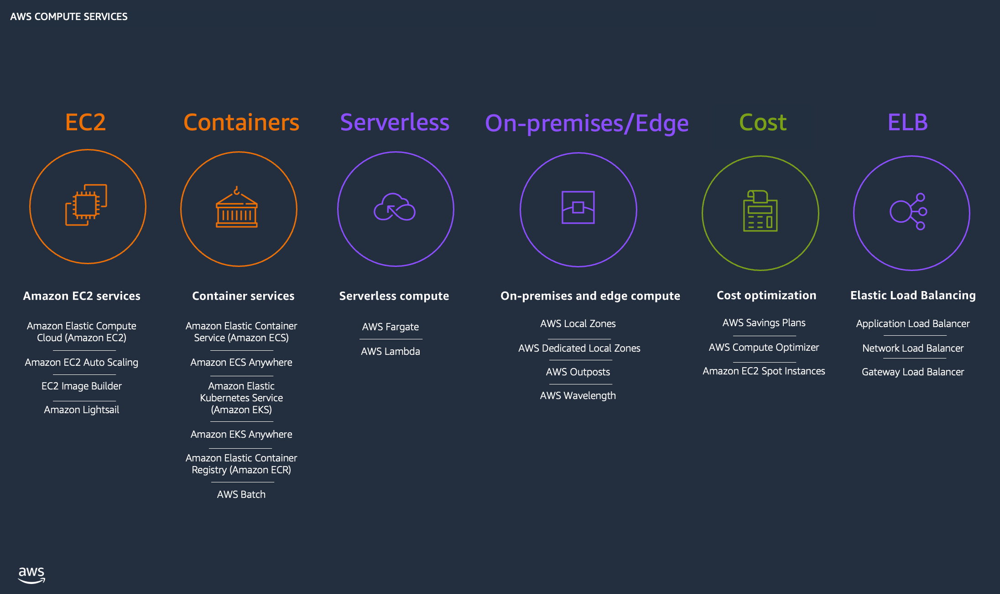
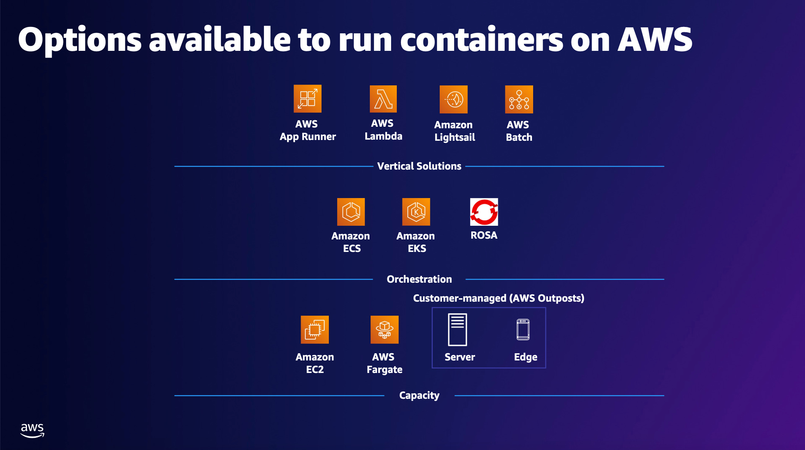
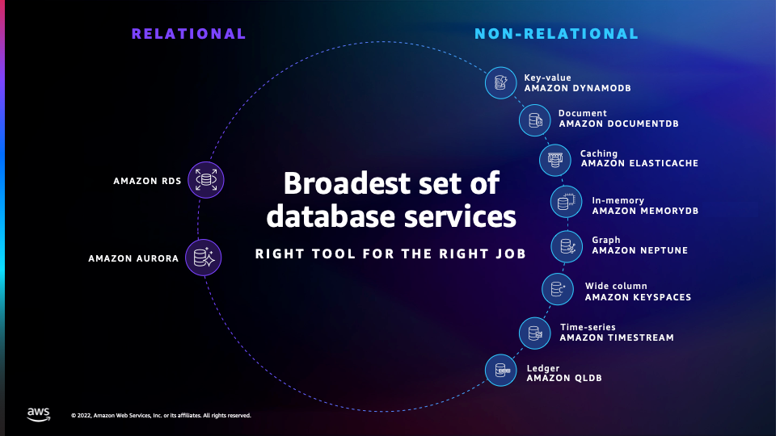
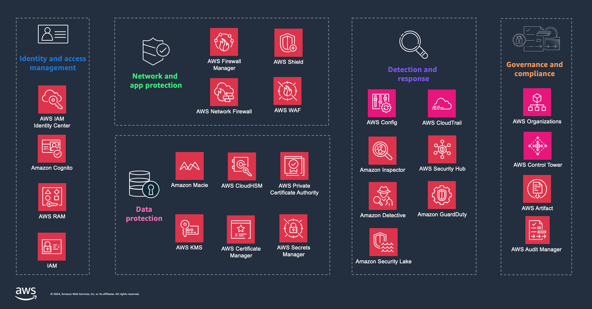
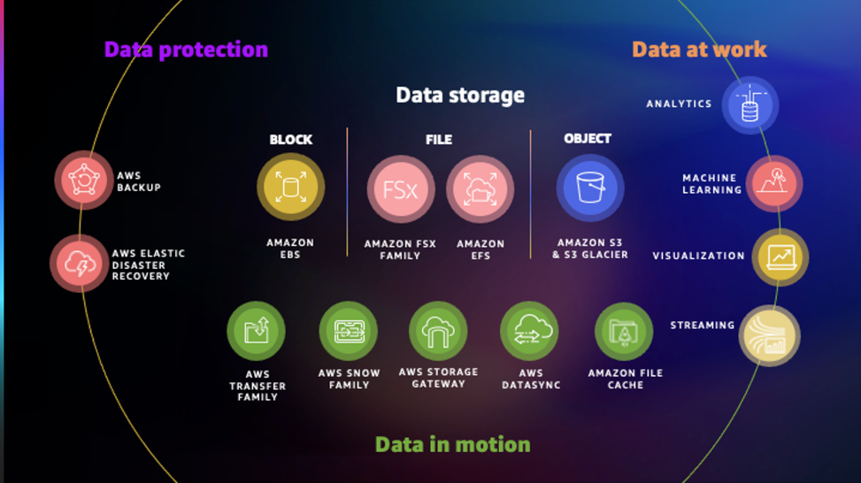

# AWS Services

## Compute
- Amazon EC2
- Amazon Lightsail
- Amazon Elastic Container Service

## Containers
- AWS Fargate: Serverless compute for containers
- Amazon Elastic Container Registry
Easily store, share, and deploy your container software anywhere
- AWS Copilot
Command line interface for containerized applications
- Red Hat OpenShift Service on AWS
Managed OpenShift integration in the cloud
- Amazon Elastic Container Service
Run highly secure, reliable, and scalable containers

- AWS App2Container
Containerize and migrate existing applications

## Databases
- Amazon RDS for Db2
Easy to manage relational databases optimized for total cost of ownership
- Amazon MemoryDB
Valkey- and Redis OSS-compatible, durable, in-memory database service for ultra-fast performance
- Amazon Relational Database Service
Easy to manage relational databases optimized for total cost of ownership

- Amazon Relational Database Service Custom
Managed database services for applications that require operating system and database customization

- Amazon ElastiCache
Serverless, fully managed caching service delivering microsecond latency with Valkey-, Memcached-, and Redis OSS-compatibility
- Amazon Redshift
Deliver unmatched price-performance at scale with SQL for your data lakehouse

- Amazon DynamoDB
Serverless, NoSQL, fully managed database with single-digit millisecond performance at any scale

- Amazon Keyspaces (for Apache Cassandra)
A scalable, highly available, and managed Apache Cassandra–compatible database service
- Amazon Aurora
Unparalleled high performance and availability at global scale for PostgreSQL, MySQL, and DSQL

- Amazon DocumentDB (with MongoDB compatibility)
Fully managed, cost-effective, MongoDB-API compatible document database service

## Networking and Content Delivery
- Amazon CloudFront
Securely deliver content with low latency and high transfer speeds
- Amazon Virtual Private Cloud
Define and launch AWS resources in a logically isolated virtual network
- Amazon API Gateway
Create, maintain, and secure APIs at any scale

## Security,Identity and Compliance
- AWS Identity and Access Management
Securely manage identities and access to AWS services and resources
- Amazon Security Lake
Automatically centralize your security data in a few steps
- Amazon GuardDuty
Protect your AWS accounts, workloads, and data with intelligent threat detection

## Storage

## AWS Key Management Service
AWS Key Management Service (AWS KMS) makes it easy for you to create and manage cryptographic keys and control their use across a wide range of AWS services and in your applications. AWS KMS uses hardware security modules (HSM) to protect and validate your AWS KMS keys under the FIPS 140-2 Cryptographic Module Validation Program. AWS KMS is integrated with AWS CloudTrail to provide you with logs of all key usage to help meet your regulatory and compliance needs.

## AWS Secrets Manager
AWS Secrets Manager helps you protect secrets needed to access your applications, services, and IT resources. The service enables you to easily rotate, manage, and retrieve database credentials, API keys, and other secrets throughout their lifecycle. Users and applications retrieve secrets with a call toSecrets Manager APIs, eliminating the need to hardcode sensitive information in plain text. Secrets Manager offers secret rotation with built-in integration for Amazon RDS, Amazon Redshift, and Amazon DocumentDB. The service is also extensible to other types of secrets, including API keys and OAuth tokens. In addition, Secrets Manager enables you to control access to secrets using fine-grained permissions and audit secret rotation centrally for resources in the AWS Cloud, third-party services, and on-premises.

## AWS IAM Identity Center
AWS IAM Identity Center (SSO) is a cloud SSO service that makes it easy to centrally manage SSO access to multiple AWS accounts and business applications. With just a few clicks, you can enable a highly available SSO service without the upfront investment and on-going maintenance costs of operating your own SSO infrastructure. With IAM Identity Center, you can easily manage SSO access and user permissions to all of your accounts in AWS Organizations centrally. IAM Identity Center also includes built-in SAML integrations to many business applications, such as Salesforce, Box, and Microsoft Office 365. Further, by using the IAM Identity Center application configuration wizard, you can create Security Assertion Markup Language (SAML) 2.0 integrations and extend SSO access to any of your SAML-enabled applications. Your users simply sign in to a user portal with credentials they configure in IAM Identity Center or using their existing corporate credentials to access all their assigned accounts and applications from one place.