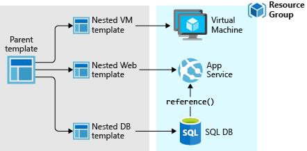
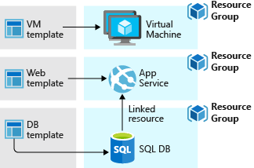

# Azure Template
infrastructure as code: In code, you define the infrastructure that needs to be deployed. The infrastructure code is part of your project. Just like application code, store the infrastructure code in a source repository and version it. Anyone on your team can run the code and deploy similar environments.

To `implement infrastructure as code for your Azure solutions, use Azure Resource Manager templates (ARM templates)`. The template is a JavaScript Object Notation (JSON) file that defines the infrastructure and configuration for your project. The template uses declarative syntax, which lets you state what you intend to deploy without having to write the sequence of programming commands to create it. In the template, you specify the resources to deploy and the properties for those resources. You can also specify in which resource group those resources are deployed.

Templates are idempotent, which means you can deploy the same template many times and get the same resource types in the same state

the following file creates a storage account. If you deploy this template and the storage account with the specified properties already exists, no changes are made
```json
{
  "$schema": "https://schema.management.azure.com/schemas/2019-04-01/deploymentTemplate.json#",
  "contentVersion": "1.0.0.0",
  "parameters": {
    "location": {
      "type": "string",
      "defaultValue": "[resourceGroup().location]"
    }
  },
  "resources": {
    "mystore": {
      "type": "Microsoft.Storage/storageAccounts",
      "apiVersion": "2023-04-01",
      "name": "mystorageaccount",
      "location": "[parameters('location')]",
      "sku": {
        "name": "Standard_LRS"
      },
      "kind": "StorageV2"
    }
  }
}
```
It converts the definition to the following REST API operation, which it sends to the Microsoft.Storage resource provider:

```http
PUT
https://management.azure.com/subscriptions/{subscriptionId}/resourceGroups/{resourceGroupName}/providers/Microsoft.Storage/storageAccounts/mystorageaccount?api-version=2022-09-01
REQUEST BODY
{
  "location": "centralus",
  "sku": {
    "name": "Standard_LRS"
  },
  "kind": "StorageV2",
  "properties": {}
}

```

To deploy a template, use any of the following options:

- Azure portal
- Azure CLI
- PowerShell
- REST API
- Button in GitHub repository
- Azure Cloud Shell

## Template design
You don't have to define your entire infrastructure in a single template. Often, it makes sense to divide your deployment requirements into a set of targeted, purpose-specific templates. You can easily reuse these templates for different solutions. To deploy a particular solution, create a main template that links all the required templates. The following image shows how to deploy a three-tier solution through a parent template that includes three nested templates.



If you envision your tiers having separate lifecycles, you can deploy your three tiers to separate resource groups. The resources can still be linked to resources in other resource groups.


## Template file
The template has the following sections:

- Parameters - Provide values during deployment that you customize for different environments when using the same template.

- Variables - Define values that you reuse in your templates. You can construct them from parameter values.

- User-defined functions - Create customized functions that simplify your template.

- Resources - Specify the resources to deploy.

- Outputs - Return values from the deployed resources.


## Template deployment process

When you deploy a template, Resource Manager converts the template into REST API operations. For example, when Resource Manager receives a template with the following resource definition:

```json
"resources": [
  {
    "type": "Microsoft.Storage/storageAccounts",
    "apiVersion": "2022-09-01",
    "name": "mystorageaccount",
    "location": "centralus",
    "sku": {
      "name": "Standard_LRS"
    },
    "kind": "StorageV2"
  },
]
```
[azure-resource-manager/templates/overview)](https://learn.microsoft.com/en-us/azure/azure-resource-manager/templates/overview)
Azure Resource Manager
- Azure-only: Native to Azure, and only supports Azure.
- Language: JSON (or Bicep, a newer, simpler DSL that transpiles to ARM JSON).
- State: No external state management — the "state" lives in Azure itself.
- Execution: Deployed directly using Azure Resource Manager.

 Terraform
- Cloud-agnostic: Supports multiple providers — Azure, AWS, GCP, Kubernetes, etc.
- Language: HCL (HashiCorp Configuration Language), human-readable and easier than JSON.
- Execution: Uses the Terraform engine (terraform apply, terraform plan, etc.).
- Tooling: Extensive ecosystem and plugin support.
- State: Requires and manages state files (can be local or remote, e.g., in Azure Storage).

AWS Cloud Formation ,Google Cloud Demployment Manager and Azure Resource Manager are cloud specific while Pulumi and Terraform are cloud agnostic


TThree ways to provision cloud resources
- GUI
- Api/cli
- Infrastructure as code

Categories of IaC tools:
- Ad hoc scripts
- Configuration management tools eg ansible,chef
- Server Templating tools eg Amazon Machine Image(AMI)
- Orchestration tools eg kubernetes for orchestration of containers
- provisioning tools( declarative vs imperative)


Terraform is a tool for building,changing and versioning infrastructure safely and efficiently

Enables application software best practices to infrastructure
 compactible with many clouds and services

 ## Common Patterns

 - terraform + Ansible

 Terraform used to provision resources(VMs) and use Ansible to install all dependencies in these resources 

 - Terraform + Server Templating
 - Terraform + Orchestration(kubernetes)

 ```tf
 terraform plan
 terraform apply
 terraform destroy
 ```


### Azure Compute
Access cloud compute capacity, virtualization, and scale on demand—and only pay for the resources you use
Azure compute provides the infrastructure you need to run your apps

- Virtual Machines: Provision Linux and Windows virtual machines in seconds with the configurations of your choice 

- Windows Server: Host Windows Server virtual machines in Azure or in hybrid environments or host and manage 	

- Virtual Machine Scale Sets: Achieve high availability by autoscaling to create thousands of VMs in minutes 	

- Azure Kubernetes Service (AKS): Deploy and scale containers on managed Kubernetes 	

- Azure Functions: Accelerate app development using an event-driven, serverless architecture 	

- Azure Service Fabric: Develop microservices and orchestrate containers on Windows and Linux 

- App Service: Quickly create cloud apps for web and mobile with fully managed platform 	

- Azure Container Instances: Containerize apps and easily run containers with a single command 

- Batch: Cloud-scale job scheduling and compute management with the ability to scale to tens, hundreds, or thousands of virtual machines 	

- Cloud Services: Create highly available, scalable cloud applications and APIs that help you focus on apps instead of hardware 

- Azure Dedicated Host: Deploy your Azure virtual machines on a physical server only used by your organization 	

- Azure Compute Fleet PREVIEW: Easily provision and manage Azure compute capacity at scale 	

- Azure Container Apps: Run modern apps and microservices using serverless containers at any scale 


## Azure Database services

### Relational database services
- Azure SQL Database
Build limitless, trusted, AI-ready apps on a fully managed SQL database

- Azure SQL Managed Instance
Modernize SQL Server applications with a managed, always-up-to-date SQL instance in the cloud.

- SQL Server on Azure Virtual Machines
Host enterprise SQL Server apps in the cloud and save 

- Azure Database for PostgreSQL
Innovate with a fully managed, AI-ready PostgreSQL database.

- Azure Database for MySQL
Innovate with an intelligent, open-source MySQL database in the cloud.
- Oracle Database@Azure
### NoSQL database services
- Azure Cosmos DB
Develop AI-powered apps with a fully managed and serverless NoSQL vector database at any scale.

- Azure Managed Instance for Apache Cassandra
Modernize Cassandra data clusters with a managed instance in the cloud.

- MongoDB Atlas (pay-as-you-go)
### Caching

Azure Managed Redis
Accelerate app performance with fully managed, scalable, in-memory solution.


## Identity and access management (IAM)
Secure access to your resources with Azure identity and access management solutions.


## Azure Networking
Connect and deliver your hybrid and cloud-native applications with low-latency, Zero Trust based networking services

- Azure Virtual Network: Connect everything from virtual machines to incoming VPN connections 	
- Azure Load Balancer: Balance inbound and outbound connections and requests to applications 	
- Azure DDoS Protection: Protect your applications from DDoS attacks 	
- Azure Firewall: Native firewall capabilities with built-in high availability and zero maintenance 	
- Azure Firewall Manager: Manage network security policy and routing centrally 	
- Azure Bastion: Private and fully managed RDP and SSH access to your virtual machines 	
- Azure Private Link: Private access to services hosted on the Azure platform 	
- Traffic Manager: Route incoming traffic for better performance and availability 	
- Network Watcher: Monitor and diagnose network issues 	
- Azure Network Function Manager: Extend Azure management for deploying 5G and SD-WAN network functions on edge devices 	
- Azure ExpressRoute: Add private network connectivity from your corporate network to cloud 	
- Azure Virtual WAN: Connect business offices, retail locations, and sites securely with a unified portal 	
- Azure VPN Gateway: Securely use the internet to access Azure Virtual Networks 	
- Routing preference: Choose how your traffic routes between Azure and the Internet 	
- Azure CDN: Accelerate the delivery of high-bandwidth content to customers worldwide 	
-Azure Front Door: Scalable, security-enhanced delivery point for global, microservice-based web applications 	
- Azure Application Gateway: Manage traffic to your web applications with a web traffic load balancer. 	
- Azure Web Application Firewall: Use a firewall service for web apps to help improve web app security 	
- Azure DNS: Ensure ultra-fast DNS responses and availability for your domain needs. 	
- Internet Analyzer: Test how networking infrastructure changes will impact performance 	
- Azure NAT Gateway: Provide highly scalable, resilient, and secure outbound connectivity for virtual networks 	
- Azure Programmable Connectivity: Create cloud and edge-native applications that interact with the intelligence of network. 	


## Security
Strengthen the security of your cloud workloads with built-in services.

- Microsoft Defender for Cloud: Unify security management and enable advanced threat protection for workloads in the cloud and on-premises 	
- Key Vault: Safeguard cryptographic keys and other secrets used by cloud apps and services 	
- Azure DDoS Protection: Protect your Azure resources from denial of service threats 	
- Azure Information Protection: Control and help secure email, documents, and sensitive data that you share outside your company 	
- Application Gateway: Protect your applications from common web vulnerabilities and exploits with a built-in web application firewall 	


## Storage
Secure, high-performance, reliable, and scalable cloud storage

- Azure Disk Storage: High-performance, durable block storage for business-critical applications 	 
- Azure Blob Storage: Massively scalable and secure object storage for cloud-native workloads, archives, data lakes, high-performance computing, and machine learning 	
- Azure Data Lake Storage: Massively scalable and secure data lake for your high-performance analytics workloads 	
- Azure Files: Simple, secure, and serverless enterprise-grade cloud file shares 	
- Azure NetApp Files: Enterprise-grade Azure file shares, powered by NetApp 	
- Azure File Sync: Hybrid cloud file shares for caching your on-premises data 	
- Azure Stack Edge: Cloud storage gateway to transfer data efficiently and easily between the cloud and the edge 	
- Azure Data Box: Appliances and solutions for transferring data into and out of Azure quickly and cost-effectively 	
- Azure Elastic SAN: Elastic SAN is a cloud-native Storage Area Network (SAN) service built on Azure. Gain access to an end-to-end experience like your on-premises SAN. 	
- Azure Container StoragePREVIEW: Manage persistent storage volumes for stateful container applications 	
- Azure Storage Actions: Simplify storage data management tasks at massive scale 	


## Web
Build powerful, intelligent web applications
Build on a fully-managed platform to:

- App Service
Develop and deploy web apps at any scale using .Net Core, Java, Docker, Node.js, and more.
  - Launch websites quickly, with broad CMS support from the Azure Marketplace.
  - Accelerate your feature updates using built-in CI/CD.

 -	Content Delivery Network 
 Accelerate the delivery of high-bandwidth content—from applications and stored content to streaming video—to customers worldwide. 

- Azure DNS 
Ensure ultra-fast DNS responses and ultra-high availability for all your domain needs. 	
- Application Gateway
Optimize delivery from application server farms while increasing application security with a web application firewall. 	

- Azure Container Apps
Build and run containerized web applications with ease and scale.
Need increased flexibility in your application platform while keeping costs low.


## Microsoft.Storage/storageAccounts resource
An Azure storage account contains all of your Azure Storage data objects: blobs, files, queues, and tables. The storage account provides a unique namespace for your Azure Storage data that's accessible from anywhere in the world over HTTP or HTTPS. Data in your storage account is durable and highly available, secure, and massively scalable.
### ARM template resource definition
#### Resource format

To create a Microsoft.Storage/storageAccounts resource, add the following JSON to your template.

```json

{
  "type": "Microsoft.Storage/storageAccounts",
  "apiVersion": "2024-01-01",
  "name": "string",
  "extendedLocation": {
    "name": "string",
    "type": "string"
  },
  "identity": {
    "type": "string",
    "userAssignedIdentities": {
      "{customized property}": {
      }
    }
  },
  "kind": "string",
  "location": "string",
  "properties": {
    "accessTier": "string",
    "allowBlobPublicAccess": "bool",
    "allowCrossTenantReplication": "bool",
    "allowedCopyScope": "string",
    "allowSharedKeyAccess": "bool",
    "azureFilesIdentityBasedAuthentication": {
      "activeDirectoryProperties": {
        "accountType": "string",
        "azureStorageSid": "string",
        "domainGuid": "string",
        "domainName": "string",
        "domainSid": "string",
        "forestName": "string",
        "netBiosDomainName": "string",
        "samAccountName": "string"
      },
      "defaultSharePermission": "string",
      "directoryServiceOptions": "string"
    },
    "customDomain": {
      "name": "string",
      "useSubDomainName": "bool"
    },
    "defaultToOAuthAuthentication": "bool",
    "dnsEndpointType": "string",
    "enableExtendedGroups": "bool",
    "encryption": {
      "identity": {
        "federatedIdentityClientId": "string",
        "userAssignedIdentity": "string"
      },
      "keySource": "string",
      "keyvaultproperties": {
        "keyname": "string",
        "keyvaulturi": "string",
        "keyversion": "string"
      },
      "requireInfrastructureEncryption": "bool",
      "services": {
        "blob": {
          "enabled": "bool",
          "keyType": "string"
        },
        "file": {
          "enabled": "bool",
          "keyType": "string"
        },
        "queue": {
          "enabled": "bool",
          "keyType": "string"
        },
        "table": {
          "enabled": "bool",
          "keyType": "string"
        }
      }
    },
    "immutableStorageWithVersioning": {
      "enabled": "bool",
      "immutabilityPolicy": {
        "allowProtectedAppendWrites": "bool",
        "immutabilityPeriodSinceCreationInDays": "int",
        "state": "string"
      }
    },
    "isHnsEnabled": "bool",
    "isLocalUserEnabled": "bool",
    "isNfsV3Enabled": "bool",
    "isSftpEnabled": "bool",
    "keyPolicy": {
      "keyExpirationPeriodInDays": "int"
    },
    "largeFileSharesState": "string",
    "minimumTlsVersion": "string",
    "networkAcls": {
      "bypass": "string",
      "defaultAction": "string",
      "ipRules": [
        {
          "action": "Allow",
          "value": "string"
        }
      ],
      "resourceAccessRules": [
        {
          "resourceId": "string",
          "tenantId": "string"
        }
      ],
      "virtualNetworkRules": [
        {
          "action": "Allow",
          "id": "string",
          "state": "string"
        }
      ]
    },
    "publicNetworkAccess": "string",
    "routingPreference": {
      "publishInternetEndpoints": "bool",
      "publishMicrosoftEndpoints": "bool",
      "routingChoice": "string"
    },
    "sasPolicy": {
      "expirationAction": "string",
      "sasExpirationPeriod": "string"
    },
    "supportsHttpsTrafficOnly": "bool"
  },
  "sku": {
    "name": "string"
  },
  "tags": {
    "{customized property}": "string"
  }
}
```

A storage account provides a unique namespace in Azure for your data. Every object that you store in Azure Storage has an address that includes your unique account name. The combination of the account name and the Blob Storage endpoint forms the base address for the objects in your storage account.


Popular IaC optimization tools and technologies include:

- Chef
- Puppet
- Red Hat Ansible Automation Platform
- SaltStack
- Terraform
- AWS CloudFormation